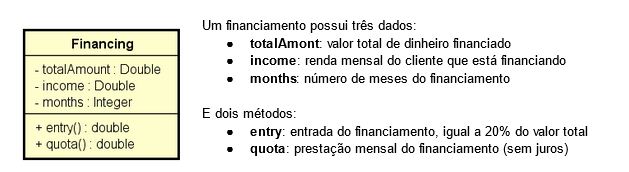
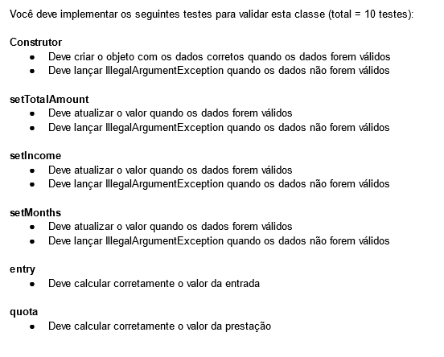

# Testes unitários com Junit Vanilla

Este é o primeiro desafio de testes unitários da DevSuperior. Estes desafio tem como objetivo criar 10 testes unitários a partir de uma determinada classe, implementando novas funcionalidades de verificação para passar nos testes.

---

Classe do projeto:

---

### **Desafio do projeto**

 

